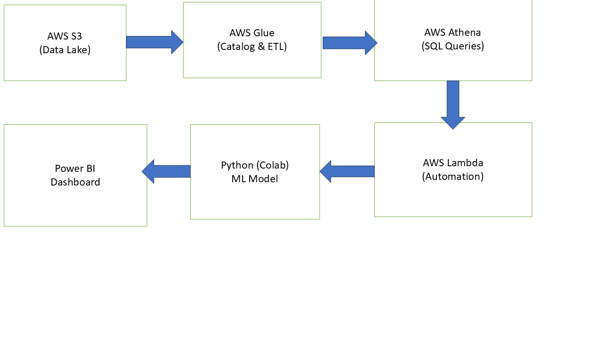
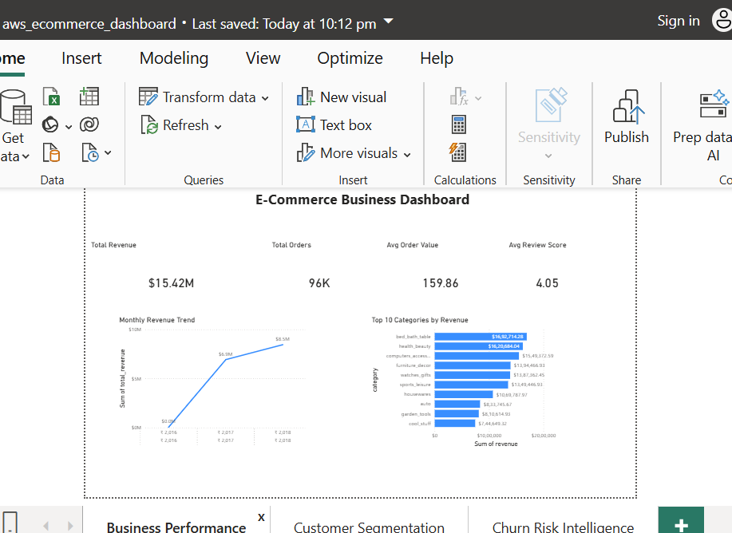
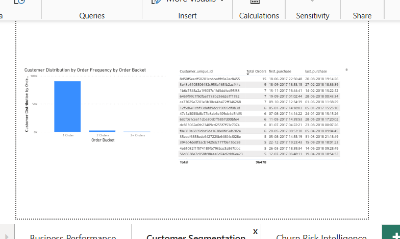
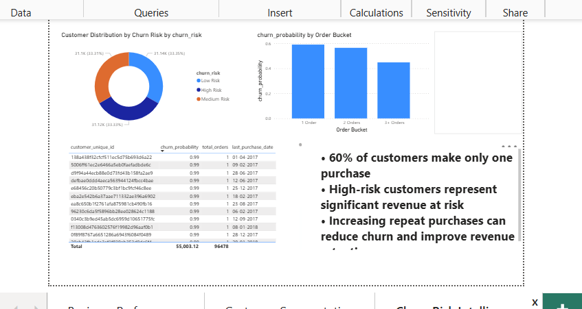

# 🛒 AWS E-Commerce Analytics Pipeline with Churn Prediction

An end-to-end data pipeline built using AWS, SQL, Machine Learning, and Power BI to analyze e-commerce data and predict customer churn.

---

## 📊 Project Overview

This project demonstrates a complete data workflow:

- Built a scalable data lake using AWS S3
- Automated metadata cataloging using AWS Glue
- Performed SQL analytics using AWS Athena
- Developed a customer churn prediction model using Python (Scikit-learn)
- Created an interactive Power BI dashboard for business insights

---

## ⚙️ Tech Stack

- **AWS S3** → Data Lake  
- **AWS Glue** → Data Catalog & ETL  
- **AWS Athena** → SQL Query Engine  
- **AWS Lambda** → Automation Trigger  
- **Python (Google Colab)** → Data Processing & Machine Learning  
- **Scikit-learn** → Random Forest Model  
- **Power BI** → Dashboard Visualization  

---

## 🏗️ Architecture



### 🔄 Pipeline Flow

1. Raw CSV data uploaded to **AWS S3**
2. **Glue Crawler** catalogs data into tables
3. **Athena** runs SQL queries directly on S3
4. Data exported and processed in **Google Colab**
5. Machine learning model predicts churn probability
6. Results visualized in **Power BI dashboard**

---

## 📁 Project Structure
├── dashboard/ → Power BI dashboard screenshots
├── data/ → Athena query outputs
├── rawdata/ → Raw datasets
├── sql/ → Athena SQL queries
├── architecture.png → Pipeline diagram
├── aws_ecommerce_etl_ml_pipeline.ipynb → ML notebook
└── README.md


---

## 📊 Dashboard

### 📈 Business Performance


### 👥 Customer Segmentation


### ⚠️ Churn Risk Intelligence


---

## 🔍 Key Business Insights

- ~60% of customers make only **one purchase**, indicating low retention
- Customers with fewer orders show **higher churn probability**
- High-risk customers contribute **significant revenue at risk**
- Increasing repeat purchases can **reduce churn and improve revenue retention**

---

## 🤖 Machine Learning Model

- **Model:** Random Forest Classifier  
- **Goal:** Predict customer churn probability  
- **Features Used:**
  - total_orders  
  - total_revenue  
  - avg_order_value  
  - avg_review_score  
  - avg_delivery_delay  
  - days_since_last_purchase  
  - customer_lifetime_days  

---

## 📊 Model Performance

- **AUC Score:** 1.00  
- High model performance due to strong feature engineering and a structured dataset

---

## ⚠️ Business Impact

- Identified high-risk customers contributing approximately:

```text
$3,879,087 revenue at risk

Enables targeted retention strategies for high-value customers
